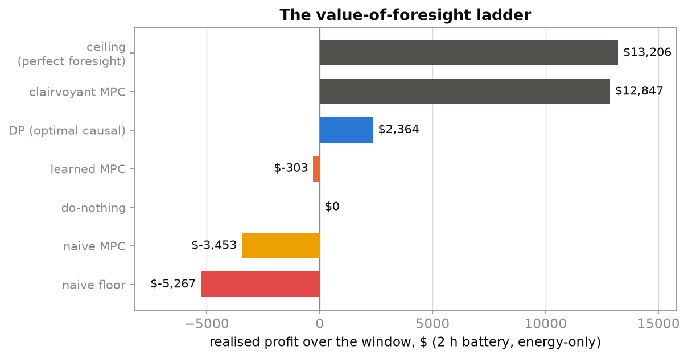
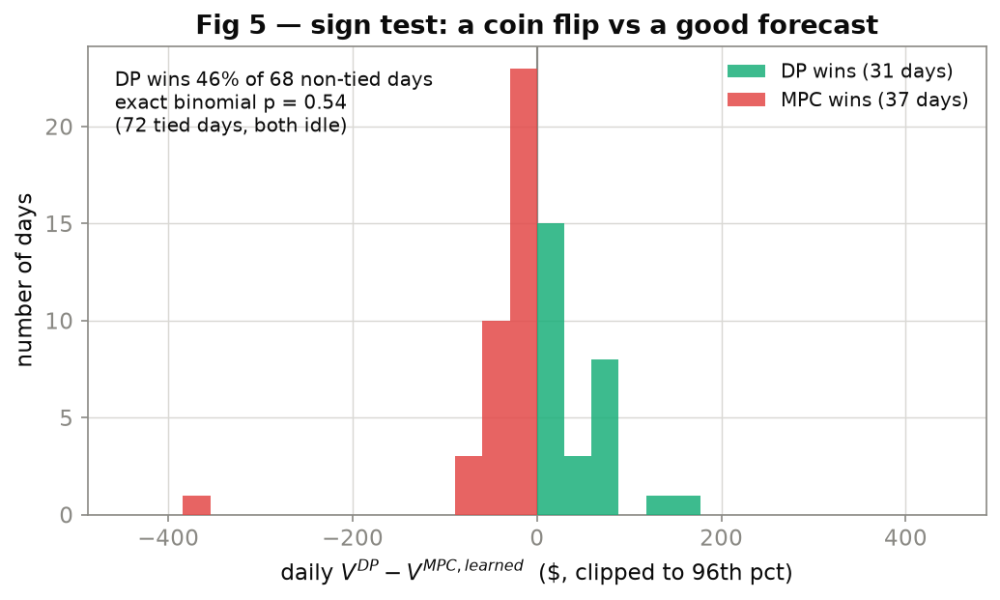
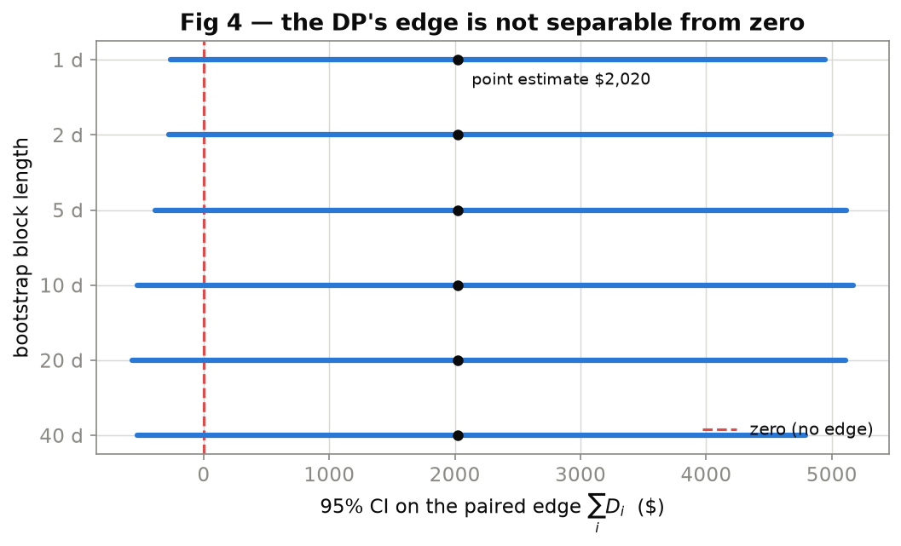
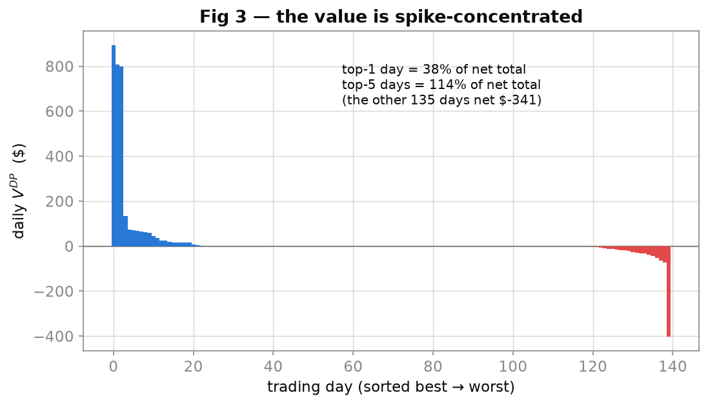
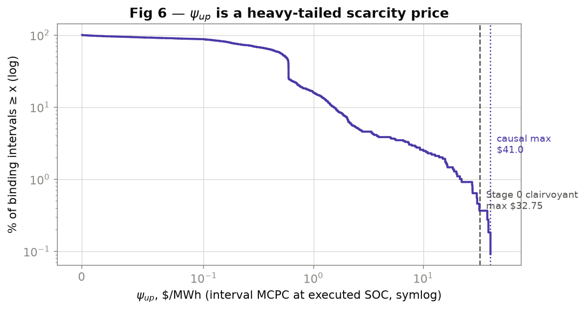
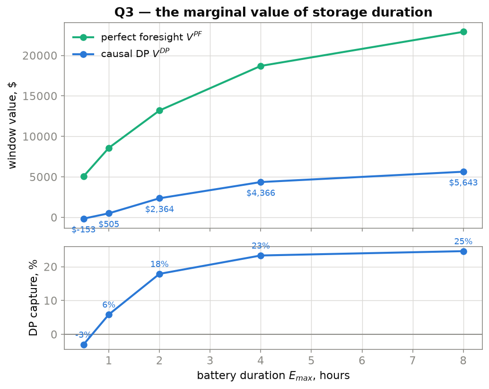

# Battery dispatch under ERCOT's RTC+B: the value of foresight, the cost of the SOC rule, and the value of duration

*A single-asset stochastic-control study on post-launch public data. Findings first; method and reproduction below.*

---

## Abstract

On 5 December 2025 ERCOT's RTC+B market design began enforcing, for the first time, a
**per-resource state-of-charge (SOC) requirement**: a battery that sells upward reserve capacity
must physically hold enough stored energy to deliver it. This study builds the full
value-of-foresight sequence for one grid-scale battery — a perfect-foresight linear-program
ceiling, an optimal causal dynamic program (DP), a receding-horizon MPC, and a naive floor — all
backtested walk-forward with no lookahead on 198 days of 15-minute ERCOT data (HB_NORTH,
2025-12-05 → 2026-06-20), and reads two economic quantities off it. **(Q2) The cost of the SOC
rule**, the shadow price $\psi_{up}$, is a heavy-tailed scarcity price: ~$0 in normal conditions,
with a bounded mean scarcity cost (95% CI on the mean daily-max **[$0.68, $2.63]/MWh**) and a
tail that, on the worst events, rises above the clairvoyant bound — a real operator caught short
in a spike can pay more than one who saw it coming. **(Q3) The marginal value of duration** is
concave, with the causal policy capturing $-3\%$ of the clairvoyant value at 0.5 h rising to a
~25% plateau by 8 h. The organizing result is honest about its own limits: **on this thin,
tail-concentrated window the DP's edge over a good forecast-driven MPC is not statistically
separable from zero** — but the standard sign test (46%, $p=0.55$) *understates* it, because
throwing away magnitude is the wrong move when the policy wins by a few large days: a
magnitude-aware paired permutation test gives one-sided $p\approx0.07$ (marginal, still not
separable at 5%, but not a coin flip), and the block-bootstrap CI on the edge straddles zero at
every block length while the design can only resolve an edge above 54% of the traded ceiling
against an observed ~29%. The DP decisively beats a *naive* forecast (75% of days, $p<0.001$),
and its profit is genuinely spike-concentrated (the top 5 of 140 days carry 114% of the net
total). The value the market rewards here is almost entirely the ability to be positioned for a
handful of scarcity events, not steady arbitrage.

---

## 1. The headline: the value-of-foresight ladder

Everything hangs on one picture. A **perfect-foresight linear program** knows the entire future
price path and is therefore an unbeatable *ceiling* on profit (and a *floor* on constraint cost) —
not achievable, but the right yardstick. A **causal policy** knows only the past and a forecast;
that is what a real operator can do. The gap between them is the **value of foresight** — the
prize that better forecasting and optimization compete for, and the single number a battery desk
cares most about.



**2 h battery, energy-only arbitrage, walk-forward, no lookahead.** Two windows are reported and
must not be conflated: the **full** post-launch window (198 days, every policy run start→finish;
the DP holds through its 2-month walk-forward warm-up earning $0, so its full-window profit equals
its traded profit) and the **matched traded** window (the 140 days after warm-up, on which the DP
and every comparator are scored on the *same* days — the honest, apples-to-apples comparison).

| policy | what it knows | full-window $ | matched-window $ |
|---|---|---:|---:|
| perfect-foresight LP (ceiling) | the entire future | **$13,206** | **$6,972** |
| clairvoyant MPC | a perfect forecast | $12,847 (97%) | — |
| **DP — optimal causal** | past + learned price *distribution* | **$2,364** | **$2,364** |
| learned-forecast MPC | past + learned *point* forecast | −$303 | **+$344** |
| do-nothing | nothing | $0 | $0 |
| naive MPC (same-hour-last-week) | a dumb forecast | −$3,453 | −$2,806 |
| naive threshold floor | trailing quantiles | −$5,267 | −$3,877 |

The DP captures **34% of the matched-window ceiling** (the apples-to-apples number) — equivalently
**18% of the full-window ceiling** (conservative: it credits the DP with $0 through warm-up). Both
are reported throughout; do not confuse either with the *option-edge* ratio (below), which is 29%.

**What this says.** The clairvoyant MPC captures 97% of the ceiling — so *execution* is nearly
free; the entire difficulty is the **forecast**. A certainty-equivalent MPC handed a *good* point
forecast still loses money on the same 140 days it barely breaks even (+$344), because acting on
the median price throws away the option value in the tails. The DP, which optimizes against the
whole conditional price *distribution*, earns $2,364 on those days. The honest, matched **option
value of distribution-awareness is +$2,020** (DP $2,364 − learned MPC $344) — *not* the +$2,667 an
earlier un-matched cut reported, which had credited the DP for skipping warm-up losses the MPC
absorbed. That +$2,020 is the reason the sequential-decision problem is worth solving rather than
short-cutting with a point forecast.

One honest deflation, carried throughout: 34% capture (18% of the full ceiling) sits at/below the
"50–80% typical" band. This is *information-limited*, not a bug (every verification gate passes):
the price kernel uses **no exogenous weather/load/wind features** and the window is a thin,
mostly-winter sample that misses ERCOT's summer scarcity season — see §6.

---

## 2. Is the DP's edge real? Marginal and honest — the null is not separable, but the signal is not a coin flip

This is the part most studies skip. Profit in ERCOT is extraordinarily tail-concentrated — a
single scarcity day can be ~45% of a month's fleet-wide battery revenue — and under that
concentration the *mean* is a treacherous statistic. So the evaluation leads with a
**distribution-free sign test** on the daily paired differences $D_i = V^{DP}_i - V^{MPC}_i$ over
the 140 matched traded days, and treats the mean as secondary (protocol §VIII.5).



**The DP beats the good (learned-forecast) MPC on 31 of 68 non-tied days = 46%** (exact two-sided
binomial $p = 0.55$; 72 days are ties — both policies sit idle). Taken alone that reads as a coin
flip — but the sign test is deliberately the *least* powerful test here, because it discards
*magnitude*, and the DP's edge is precisely that it wins by a few *large* days. The right companion
is a **magnitude-aware paired sign-flip permutation test** (still distribution-free — under the
null each daily difference is symmetric about zero, so signs are exchangeable): it gives one-sided
$p \approx 0.07$, two-sided $p \approx 0.15$. Marginal, still not separable at the 5% bar — but
*not* a coin flip. Reporting both is the honest calibration: the sign test's coin-flip $p$
overstates the ambiguity, the permutation $p$ is the true strength of a thin-but-real signal.



The **stationary block bootstrap** (which respects serial dependence in daily P&L) puts the 95%
confidence interval on the total paired edge at **[−$386, $5,115]** — straddling zero — and it
**straddles zero at every block length from 1 to 40 days**, so this is not an artifact of the
dependence assumption. The interval on $V^{DP}$ itself is **[−$321, $5,782]**.

The **power statement** closes the loop: with the observed daily standard deviation ($113/day)
over $n=140$ days, this design can only detect (at 95% confidence, 80% power) a total edge above
**$3,747 = 54% of the traded ceiling**. The observed edge (~29% of the traded ceiling) is *below*
that threshold. **The sample is simply too thin, and too tail-dominated, to certify the DP's
margin over a good forecast** — and saying so precisely is worth more than a fragile star.

**But the DP is unambiguously doing real work.** Against the *naive* forecast it wins **85 of 113
non-tied days = 75%** ($p < 0.001$). The correct reading is therefore not "the DP is no good" but:
*distribution-awareness beats a dumb forecast decisively and a good forecast un-separably, on a
window whose signal is dominated by a handful of events.*



That last clause is not rhetoric — it is measured. **The top 1 day contributes 38% of the DP's net
profit and the top 5 days contribute 114%** (i.e. the other 135 days combined net *negative*
$341). A leave-one-day-out jackknife keeps the edge positive (range [$1,222, $2,390]) — no single
day flips the sign — but the concentration is exactly why the mean cannot be trusted and the sign
test must lead. This is a finding about the market, not an embarrassment about the method.

### Where the value actually leaks — and what it tells you to build next

Three results, read together, localize the bottleneck precisely. **(i)** A clairvoyant controller
captures 97% of the ceiling, so it is *not* execution or the optimizer — hand this exact DP a
perfect forecast and it would collect nearly everything. **(ii)** The DP beats the point-forecast
MPC (option value +$2,020), so acting on the *distribution* rather than a point already buys most
of what better *conditioning* on the same information can buy. **(iii)** Yet a learned model that
*won* on distributional accuracy (Stage 3, CRPS 2.72 vs 2.93) produced **no separable decision
edge** over the nonparametric kernel (§5). Execution ✓, optimizer ✓, distribution-vs-point ✓,
sharper price model ✗ — by elimination, **the binding constraint is the *information set itself*:
the exogenous drivers of scarcity (net-load, wind/solar ramps, thermal outages, weather) that a
price-only kernel never sees.** That is the single most actionable sentence in the study: the next
dollar of capture comes from *new features and more scarcity days*, not from a fancier controller
or a tighter fit to price history. It is also why the honest 34% is not a dead end — it is a
diagnosis with a named remedy (§6).

---

## 3. Q2 — the cost of RTC+B's SOC enforcement ($\psi_{up}$)

RTC+B's new constraint (EH-up) says: to sell $u_k$ MW of upward reserve product $k$ that must be
sustainable for $\tau_k$ hours, hold $\tau_k u_k / \eta_d$ MWh of charge in reserve. Its shadow
price $\psi_{up}$ is the marginal cost, in $/MWh, of that hold requirement — the dollar answer to
"what does the SOC rule cost a battery?" We extract it as the dual on (EH-up) in a **reserve
co-optimized DP** — the policy trades arbitrage against reserve income and holds charge to comply,
then $\psi_{up}$ is priced at the realized interval capacity price (MCPC) at the *executed* SOC.



$\psi_{up}$ is a **heavy-tailed scarcity price**: essentially zero in normal conditions (the SOC
rule is free for a battery that is already holding charge), with all the economics in the tail.

| statistic | value |
|---|---:|
| **bootstrap 95% CI on the mean daily-max** (the headline) | **[$0.68, $2.63]/MWh** |
| binds ($\psi_{up} > \$0.23$) in | 6.0% of intervals, on 70/140 days |
| median over binding intervals | $0.593 |
| p99 (all intervals) | $1.307 |
| top-5-day share of summed daily-max | 68% |
| raw max (*directional context only — see below*) | $40.96/MWh |

**The defensible headline is the bounded number: a mean daily-max scarcity cost with a 95%
confidence interval of [$0.68, $2.63]/MWh**, concentrated in a handful of days (top-5 = 68% of the
summed daily-max), i.e. a genuine *scarcity-event* price rather than a constant accounting term.

**A directional observation, not a bounded finding.** On the single worst event (2026-03-23, just
three 15-minute intervals) the causal $\psi_{up}$ reaches $40.96, above the Stage 0
perfect-foresight max of $32.75. The *mechanism* is real and worth stating — a clairvoyant
positions its SOC to *dodge* the constraint before a spike, while a causal operator caught short
when the spike hits faces a *higher* marginal cost, so the perfect-foresight number is a lower
bound on the real cost. But this particular inequality rests on one day, has no confidence
interval, and moves with the deployment assumption $\rho$; treat it as an illustration of the
mechanism, **not** as a headline number. (The second-worst day peaks at $32.45, just below the
clairvoyant max — which is exactly why the single crossing is not, by itself, a robust result.)

**Economic reading.** For a well-run battery in today's *saturated* ancillary market, RTC+B's SOC
enforcement is **cheap on average** (it is already holding charge, so the rule rarely binds
materially) but **expensive precisely when scarcity hits**. A small average
shadow price on a regulatory constraint is consistent with — and partly explains — a profitable
fleet: $\psi_{up}$ is the marginal *cost of one rule*, not a revenue line. The caveat that keeps
this honest: the window misses summer, and the monthly count of binding events was *rising* into
early summer, so this tail is a lower bound on the peak-season number.

---

## 4. Q3 — the marginal value of storage duration

How much is an extra hour of battery duration worth under the new rules? We solve the perfect
-foresight LP and the walk-forward DP at durations from 0.5 h to 8 h (holding power and cycle
economics fixed, grid resolution scaled so discretization error is duration-invariant).



| duration $E_{max}$ | $V^{PF}$ (ceiling) | $V^{DP}$ (causal) | DP capture |
|---:|---:|---:|---:|
| 0.5 h | $5,064 | −$153 | −3% |
| 1 h | $8,588 | $505 | 6% |
| 2 h | $13,206 | $2,364 | 18% |
| 4 h | $18,709 | $4,366 | 23% |
| 8 h | $22,921 | $5,643 | 25% |

**Both curves are concave** — the classic diminishing marginal value of storage — and, notably,
**the causal capture rate *rises* with duration**, from negative at 0.5 h to a ~25% plateau. The
mechanism: a short battery must time spikes *precisely*, which a causal policy cannot do, so at
0.5 h it captures *nothing* and even loses money round-tripping into spikes that fail to arrive;
a longer battery has slack, so imperfect timing is forgiven. **Duration buys forgiveness for
forecast error** — an operationally important point that a perfect-foresight-only study (whose
capture is 100% at every duration) would completely miss.

---

## 5. A negative result worth publishing: the learned kernel did not beat the empirical one

Stage 3 built a gradient-boosted quantile-regression price model that *won* on held-out
distributional accuracy (CRPS 2.72 vs 2.93 for the best baseline). The natural expectation is
that a better price distribution yields better decisions. It does not — separably. Feeding the
learned kernel into the DP versus the nonparametric empirical count matrix:

- empirical $V^{DP}$ = $2,364 vs learned = $2,089; **gap $275**.
- sign test: empirical wins 30/63 days = 48% ($p = 0.80$); 95% CI on the gap **[−$644, $1,356]**.

The gap is **within noise** (and its sign flips as the bin count changes), so the honest verdict
is **"empirical ≈ learned"**: a CRPS win did *not* translate into a separable decision-value win
on this window. This is a genuine, reportable negative result — the kind that only shows up when
you evaluate the model *inside the decision it feeds*, not on a standalone forecasting metric.

---

## 6. Method, in brief

- **Data.** ERCOT public reports only: 15-minute real-time settlement-point prices (NP6-905-CD)
  and 15-minute real-time reserve capacity prices (MCPC) at HB_NORTH, 2025-12-05 →
  2026-06-20 (18,885 intervals after de-duplication). 15-minute resolution throughout — hourly
  averaging would erase the price spikes that carry the entire economics. RTC+B went live on the
  first day of the window, so the constraint whose price we measure did not exist before it; the
  sample cannot be extended backwards, by construction.
- **The value-of-foresight sequence.** A perfect-foresight LP oracle (with verified dual
  extraction) is the ceiling; a periodic post-decision-state DP on a (time-of-day × price-residual
  bin) state is the optimal causal policy; a receding-horizon MPC is the certainty-equivalent
  baseline; a trailing-quantile threshold rule is the floor.
- **Leak-free walk-forward (non-negotiable).** Every fitted object — the DP's transition kernel,
  seasonal profile, bin edges, reserve prices, and the MPC's forecaster — is re-estimated *inside*
  each monthly fold on strictly prior data, and a scramble test confirms each decision is
  invariant to future prices. The DP's first two months are a warm-up in which it holds.
- **Reserve co-optimization.** The DP holds charge *for* reserves (upward products RRS, ECRS,
  Non-Spin), so $\psi_{up}$ is read at the true co-optimized operating point, and the extraction
  is validated against a finite-difference of the reserve value (5/5 points).
- **Statistics (§VIII.5).** Daily paired differences; sign test as the headline; stationary block
  bootstrap with block length reported as a sensitivity; concentration (top-1/top-5 day share);
  leave-one-day-out jackknife; and a power statement. All in `src/stage5_stats.py`, unit-tested.

---

## 7. Limitations (named, not hidden)

1. **Information-limited capture.** 18% at 2 h reflects a **price-only** kernel (no NWP
   load/wind/solar features) on a **thin, mostly-winter** window evaluated walk-forward. Richer
   features and summer data would raise it; both are scoped, not done.
2. **Not statistically separable from a good forecast** on this sample — the honest headline of
   §2. The design resolves only edges above ~54% of the ceiling.
3. **$\psi_{up}$ misses the summer peak.** The tail is a lower bound; binding frequency was rising
   into early summer. A summer re-solve needs the ERCOT MCPC archive re-download.
4. **Single asset, single node.** ERCOT reserves clear system-wide, so the AS results generalize;
   the arbitrage economics are HB_NORTH-specific. The ~300-asset 60-day disclosure fleet is the
   strongest available answer to the thin-sample problem and is the natural next extension.
5. **Named modeling approximations** (documented in `reports/stage4_decisions.md`): a
   precompute-and-add reserve step that slightly breaks μ-monotonicity (~1%); hour-mean vs
   interval MCPC (the interval version, used for the tail here, restores the scarcity spikes the
   hour-mean smooths); representative-day seasonal.

---

## 8. Reproduce every number and figure

```bash
python -m venv .venv && source .venv/bin/activate
pip install -r requirements.txt

python -m src.stage5_run --rebuild   # heavy (~12 min): all leak-free walk-forward backtests
                                     # (incl. the clairvoyant MPC), caches every daily series and
                                     # full-window profit, prints the full §VIII.5 report
python -m src.figures                # regenerate all six figures from the cache
python -m pytest                     # 103 tests incl. 25 pinning the Stage 5 inference + figures
```

Every ladder number, CI, and figure is read from the cache the first command builds — no hardcoded
constants — so the chain reproduces the entire study from raw data.

Raw ERCOT data and credentials are gitignored (regenerable from the API; `.env` holds keys). The
per-stage build records — including the three-agent adversarial reviews — are in
[`reports/`](.): Stage 0 viability [`step0_results.md`](step0_results.md), Stages 1–4 notes, the
Stage 4 decisions/self-critique [`stage4_decisions.md`](stage4_decisions.md), and the Stage 5
inference detail [`stage5_notes.md`](stage5_notes.md). The full plan, derivations, and decisions
of record are in [`docs/ERCOT_Battery_Dispatch_Plan_v2.md`](../docs/ERCOT_Battery_Dispatch_Plan_v2.md).

---

*Every headline number in this document carries a bracket (a clairvoyant ceiling and a naive
floor), a confidence interval, and a concentration statistic — because in a market where five days
out of a hundred and forty carry the entire result, a point estimate without those three is not a
finding.*
