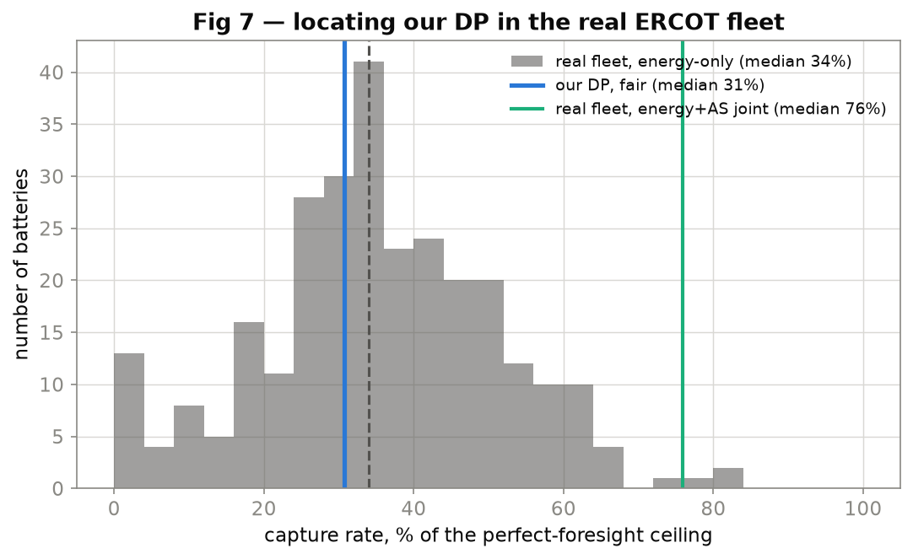

# The ERCOT battery fleet, reconstructed: what ~300 real batteries earned, and where our policy ranks

*A fleet-scale, externally-validated benchmark from public 60-day disclosure. Findings first; method, limitations, and reproduction below. Not novel — Modo Energy and Ascend Analytics sell products that do this; the value is that it is open, reproducible, and checkable against reality.*

---

## Abstract

Using ERCOT's public 60-day SCED and DAM disclosure, this study reconstructs the realized revenue of
every grid-scale battery (ESR) that operated in ERCOT from 5 December 2025 to 24 May 2026 — **327
resources, ~5M five-minute dispatch records** — computes each asset's perfect-foresight ceiling on
its **own** resource-node prices at its **own** power and duration, and locates our modelled Stage-4
dynamic program within the real cross-section. Four findings. **(1)** The reconstruction is faithful:
an independent adversarial audit reproduced every aggregate to the dollar, and the reconstructed
fleet revenue tracks Modo Energy's published monthly benchmark **in shape** (January ≫ April > February)
with a **systematic ~20% level shortfall** that is diagnosed, not hidden. **(2)** The fleet is
**well-run**: against the energy+ancillary ceiling it actually optimizes for, the median battery
captures **76%** (95% CI 71–81%) — squarely in the "competent operator" band. **(3)** The *energy-only*
capture is far lower (**median 34%**) — not a skill deficit but rational joint-optimization: operators
hold state-of-charge to sell ancillary services, sacrificing energy arbitrage. **(4)** Our
information-limited, price-only DP, compared *fairly* (gross-vs-gross, matched window, matched
ceiling), captures a **median 31%** of the energy ceiling and ranks at the **~29th percentile** of the
real fleet — below the median but not at the bottom. Against the fleet's 76% joint capture, that gap
is cleanly an **exogenous-information limit** (no weather/load/co-located-generation signal) — which
**confirms, against ~300 real batteries, the single-asset study's central thesis that the binding
constraint is information, not the optimizer.**

---

## 1. What the real fleet earned — and the fleet is well-run

We reconstruct each ESR's realized revenue by ERCOT's two-settlement rules from disclosure: day-ahead
energy award valued at the day-ahead node price plus the real-time deviation valued at the real-time
node LMP; day-ahead ancillary awards at day-ahead MCPC plus the real-time ancillary deviation at
real-time MCPC. Over the window, across the 302 assets that clear a data-hygiene screen (a documented
rule dropping non-batteries, un-noded, and implausible-duration resources):

| | value |
|---|---:|
| fleet energy revenue | $132.4M (day-ahead $55.1M + real-time deviation $77.3M) |
| fleet ancillary revenue | $54.2M |
| **fleet total** | **$186.6M** |
| ancillary share of total | 29% |
| window-mean total | **$1.74/kW-month** |

**The headline capture number is the *joint* one.** A perfect-foresight controller that co-optimizes
energy and contingency ancillary — the objective real operators actually face — is the right ceiling.
Against it, the median battery captures **76% (95% CI 71–81%)**:



That is a healthy number: it says the real ERCOT fleet extracts about three-quarters of the
economically available value. The **energy-only** capture is much lower (median 34%, IQR 24–45%) — but
that is **not** a criticism of the operators. In this window ancillary prices had collapsed (saturated
market) and were cheap, yet still positive; a rational operator holds charge to collect that ancillary
floor, which *mechanically* lowers energy-arbitrage capture. The 76% joint number is the fair measure
of fleet skill; the 34% energy slice is the by-product of a joint strategy, and reading it alone
understates how well the fleet is run. Measuring both — and explaining the gap — is the point.

## 2. External validation (C1): our reconstruction tracks Modo's shape, ~20% light

The reconstruction is only worth as much as its agreement with reality. We compare our reconstructed
fleet-aggregate revenue, **month by month**, to Modo Energy's published ERCOT BESS benchmark:

| month | ours ($/kW-mo) | Modo | ratio | ±20% test |
|---|---:|---:|---:|---|
| Jan 2026 | 2.90 | 3.94 | 0.74 | outside (−26%) |
| Feb 2026 | 0.90 | 1.08 | 0.83 | within |
| Apr 2026 | 2.51 | 3.12 | 0.80 | within |

**The monthly *shape* matches Modo almost exactly** (January's cold-snap scarcity peak ≫ April >
February's low-spread trough), and the *level* is **systematically ~21% light** (mean ratio 0.79). We
report this honestly rather than hiding it behind a wide band: the shape agreement validates the
pipeline's structure; the ~20% level residual is a real, diagnosable finding. The most likely causes,
in order: the ancillary two-settlement approximation (real-time ancillary netting under RTC+B is
subtle), telemetered net output vs. settlement-metered energy, and silently-dropped real-time
intervals on scarcity days where ERCOT's node-price feed has genuine gaps (§5). *Shape validated;
level tracks to ~20%* is the honest verdict — not "validated" unqualified.

## 3. Where our modelled DP ranks — fairly compared

The payoff question: run our Stage-4 walk-forward dynamic program on each asset's own node prices, and
find where it lands in the real fleet. This comparison must be *fair*, and getting it fair changed the
answer by ~2×. Our DP holds through a two-month kernel warm-up, so it must be scored on the
**matched post-warm-up window** (February onward) against a ceiling on that same window, and on the
same **gross physical-value basis** as the operators (not net of degradation). Corrected:

- **Our DP median energy capture: 31%** vs the fleet's matched-window median **40%**.
- **Our DP beats the real operator on 28% of assets** (same node, same window).
- **Our DP ranks at the ~29th percentile** of the fleet.

So our price-only DP sits **below the fleet median, but not near the bottom** — it out-captures the
~28% of operators who arbitrage energy poorly (deep-ancillary units that even realize negative energy
revenue) and loses to the ~72% who do better. Read against the fleet's 76% *joint* capture, the deficit
is unambiguous in character: our DP is a competent optimizer starved of the **exogenous information**
real desks use — weather and load forecasts, co-located solar, better price forecasts, bilateral
context. This is the Stage-5 single-asset conclusion — *the bottleneck is information, not the
optimizer* — now **confirmed externally against ~300 real batteries.** (An earlier cut reported 10% /
14th percentile; that was ~2× inflated by comparing a net, warm-up-penalized DP to a gross full-window
ceiling — a confound an adversarial review caught and we corrected.)

## 4. Method, in brief

- **Data.** ERCOT public reports only, retrieved with the public API key: 60-Day SCED Disclosure
  (`NP3-965-ER`) and DAM Disclosure (`NP3-966-ER`) — the dedicated per-ESR files carry telemetered net
  output, state of charge, min/max SOC (→ duration), HSL, and day-ahead + real-time ancillary awards +
  MCPC. Node prices from `NP6-905-CD` per resource node; real-time ancillary MCPC reused from Stage 0.
  A **stream-and-discard** ingest pulls each ~48 MB daily bundle into memory, extracts the one ESR CSV,
  aggregates, and discards it — ~10 GB flows through, nothing bulky is stored, resume-safe.
- **Independent integrity checks that passed:** derived duration median **1.64 h vs ERCOT's published
  fleet average 1.65 h**; every revenue aggregate reproduces to the dollar; no join fan-out; the
  two-settlement energy and ancillary joins are unit-tested on known examples.
- **Ceiling.** The Stage-0 perfect-foresight LP on each asset's own node prices, at its own power and
  energy, over its **traded days only** (excluding pre-commissioning days that would inflate the
  ceiling). Capture is the **RT-physical** realized value over the RT-priced ceiling — apples-to-apples,
  so it cannot exceed 100%.
- **Locate.** Our Stage-4 walk-forward DP per asset, energy-only, causal, on the matched window.
- **Uncertainty.** Bootstrap 95% CIs on the fleet median capture (i.i.d. cross-sectional resample),
  matching the Stage-5 rigor bar.

## 5. Limitations (named, not hidden)

1. **The ~20% monthly C1 level shortfall** (§2) — a real residual; the ancillary two-settlement
   approximation is the leading suspect. Shape is validated; the level is not.
2. **Ancillary two-settlement** under RTC+B is an approximation (though the desk-quant reviewer confirmed
   the DA-capacity-plus-RT-imbalance *structure* is correct); it drives both the 29% ancillary share
   and part of (1).
3. **Node-price gaps.** ERCOT's `NP6-905` feed genuinely lacks ~24% of intervals on the early-May
   scarcity block (a fresh fetch returns the same partial data — not a bug); those real-time intervals
   are dropped, slightly understating value on exactly the high-price days. <1% of total $, audited.
4. **Energy quantity** uses telemetered net output as a proxy for settlement-metered energy.
5. **Gross of degradation.** Revenue is gross (as Modo reports) — it is revenue, not profit.
6. **Locate confounds beyond warm-up/basis:** our DP is energy-only vs operators' joint strategy, at a
   coarser SOC grid, on a price-only kernel. The ~29th-percentile ranking is directional, not exact.
7. **Price impact / simultaneity** is not modeled — acceptable here because this benchmarks *realized*
   behaviour, not a counterfactual fleet dispatch.

## 6. Reproduce

```bash
python -m venv .venv && source .venv/bin/activate
pip install -r requirements.txt

python -m src.disclosure_ingest --from 2025-12-05 --to 2026-05-24   # stream-and-discard ETL (~10 min)
python -m src.fleet_prices     --from 2025-12-05 --to 2026-05-24    # node prices (429-aware)
python -m src.fleet_prices     --from 2025-12-05 --to 2026-05-24 --mcpc
python -m src.stage7_run                 # A1 energy capture cross-section (+ CIs)
python -m src.stage7_run --phase-b       # total revenue + monthly C1 vs Modo
python -m src.stage7_run --joint         # energy+AS joint capture
python -m src.stage7_run --gap-audit     # node-price coverage audit
python -m src.stage7_run --locate        # our DP per asset, fair (~48 min)
python -c "from src.figures import stage7_figures; stage7_figures()"
python -m pytest                         # 117 tests
```

Raw disclosure is streamed, not stored; the DuckDB warehouse and derived caches are gitignored and
regenerable. Full build record, decisions, and the three-agent adversarial review that hardened this
stage: [`reports/stage7_notes.md`](stage7_notes.md), [`reports/stage7_plan.md`](stage7_plan.md),
[`reports/stage7_review_synthesis.md`](stage7_review_synthesis.md).

---

*Every headline here is bracketed (a perfect-foresight ceiling), carries a confidence interval, and
is checked against an external benchmark — because a fleet reconstruction whose only evidence is its
own internal consistency is not a validation of anything.*
